# Signal Path and Encryption Pipeline

This document explains the "Signal Path" — the journey of an electrical signal through the Enigma machine for every character processed.

## 1. Overview

In our implementation, the signal path is modeled as a **Functional Pipeline**. Each component of the machine (Plugboard, Rotors, Reflector) acts as a transformation function that maps an input character to an output character.

The signal path is **transient**; it exists only for the duration of a single character's processing.

## 2. The Logic Sequence

For every keypress, the following sequence occurs:

1.  **Stepping:** The mechanical state of the machine changes (Rotors rotate).
2.  **Input:** The character enters the electrical circuit.
3.  **Plugboard (Forward):** Initial character swap.
4.  **Rotor Stack (Forward):** Signal passes from Right to Left (R -> M -> L).
5.  **Reflector:** The signal is "reflected" and sent back.
6.  **Rotor Stack (Reverse):** Signal passes from Left to Right (L -> M -> R).
7.  **Plugboard (Backward):** Final character swap.
8.  **Output:** The final character is displayed (Lampboard).

## 3. Visual Diagram (Mermaid)

```mermaid
graph LR
    subgraph Input_Stage [Input]
        KB[Keyboard]
    end

    subgraph Domain_Core [The Enigma Machine]
        PB_FWD[Plugboard FWD]
        
        subgraph Rotors_FWD [Rotor Stack - Forward Pass]
            R_FWD[Right Rotor]
            M_FWD[Middle Rotor]
            L_FWD[Left Rotor]
        end

        REF[Reflector]

        subgraph Rotors_REV [Rotor Stack - Reverse Pass]
            L_REV[Left Rotor]
            M_REV[Middle Rotor]
            R_REV[Right Rotor]
        end

        PB_REV[Plugboard REV]
    end

    subgraph Output_Stage [Output]
        LB[Lampboard]
    end

    %% Signal Flow
    KB --> PB_FWD
    PB_FWD --> R_FWD
    R_FWD --> M_FWD
    M_FWD --> L_FWD
    L_FWD --> REF
    REF --> L_REV
    L_REV --> M_REV
    M_REV --> R_REV
    R_REV --> PB_REV
    PB_REV --> LB
```



## 4. Traceability: The `SignalTrace` Object

To allow for debugging and "visualizing" the encryption, our `EnigmaMachine` can return a `SignalTrace` object. Instead of just returning the final character, it provides the intermediate state at every point in the pipeline.

### Proposed Structure:
```typescript
interface SignalTrace {
    input: string;
    plugboardForward: string;
    rightRotorForward: string;
    middleRotorForward: string;
    leftRotorForward: string;
    reflector: string;
    leftRotorReverse: string;
    middleRotorReverse: string;
    rightRotorReverse: string;
    plugboardReverse: string;
    output: string;
}
```

This allows the UI or CLI to show exactly where a character "turned into" another character, mirroring the path through the physical machine.
